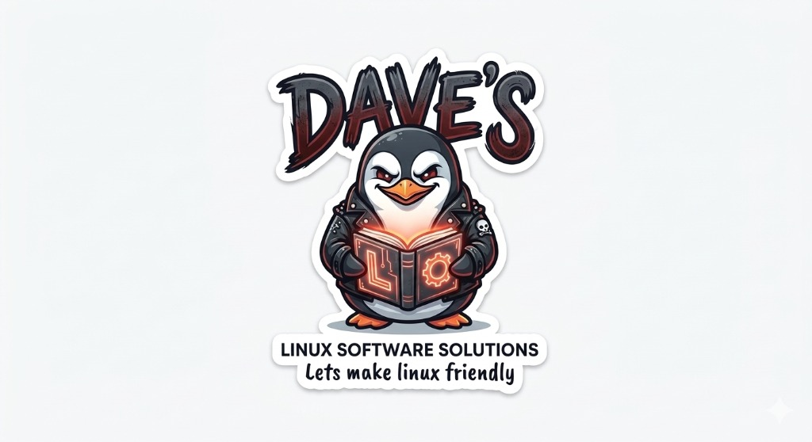

<div align="center">
  
  <h1>Dave's System Information</h1>
</div>

---

### About Us
**Dave's Linux Software Solutions**

Welcome to Dave's Linux Software Solutions, where we build open-source tools, custom desktop integrations, and specialized automated systems with one simple mission:

> **"Let's make Linux friendly."**

Whether you are a long-time user setting up a private home server or a beginner tailoring a desktop environment for gaming and daily workflows, our software bridges the gap between deep technical capability and smooth, accessible user experiences.

From optimizing system tools to creating intelligent automation pipelines, we create dependable solutions designed to make using your favorite Linux distributions straightforward, intuitive, and efficient.

---

### Features

Dave's System Information is a full-featured, PyQt5-based Task Manager built specifically for Linux.

- **📊 Overview:** Instantly view your OS, Kernel version, CPU model, GPU model, RAM, and Uptime.
- **⚙️ Processes:** Live-updating process table. Filter processes in real-time, sort by CPU/Memory usage, and easily end tasks by double-clicking or right-clicking them.
- **📈 Performance:** Clean graphs displaying global memory usage and individual CPU core performance/temperatures. 
- **💾 Disk:** Monitor mounted partitions, file system types, space usage, and live Read/Write I/O speeds.
- **🌐 Network:** Track active network interfaces and monitor live Upload/Download traffic.

### Installation

#### Using the `.deb` Installer (Recommended)
You can easily install the pre-packaged standalone `.deb` binary on any Debian or Ubuntu system. This requires no Python dependencies!

```bash
sudo dpkg -i daves-system-info_1.0_amd64.deb
```
Once installed, you can launch the app directly from your desktop's application launcher.

#### Running from Source
If you prefer to run the raw Python script:

1. Clone the repository.
2. Install the required dependencies:
   ```bash
   pip install PyQt5 psutil pyqtgraph
   ```
3. Run the script:
   ```bash
   python main.py
   ```

### Building the Package
To build your own standalone `.deb` package, simply run the included packaging script:
```bash
./build_deb.sh
```
This script automatically utilizes `PyInstaller` to bundle the app and assets (like the logo) into a single executable, and packages it into the `.deb` structure.

---
*Created by Dave's Linux Software Solutions*
